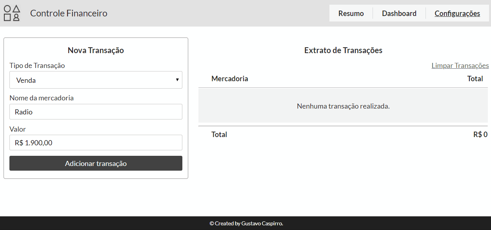

# Aplicação de Transações [](https://travis-ci.org/GustavoCaspirro/TransactionControl)



Preview: [Acesse o Preview da aplicação sobre transações](https://caspirro-transaction-control.web.app/)

## Sobre a Aplicação

- Aplicação que realiza transações de compra e venda persistindo os dados no LocalStorage, após consulta esses dados são apresentados em uma tabela.

## Primeiros passos após clonar o projeto

### Verificar se possue node e npm instalados.

```sh
// Para verificar versão do Node.
$ node -v
// Para verificar versão do NPM.
$ npm -v
```

### Caso não tenha o node instalado

- Acesse [node.js](https://nodejs.org/en/) e baixe a versão mais recente, por padrão o npm já será instalado.

### Instalação Angular CLI

- Ferramenta utilizada para rodar o projeto.

```sh
// Comando de instalação do angular CLI
$ npm install -g @angular/cli
```

### Rodar o Projeto

```sh
// Ir até a pasta raiz do projeto clonado e rodar o comando abaixo para instalar todas as dependências
$ npm install ou npm i
// Agora execute o comando abaixo para executar o projeto e abrir no navegador
$ ng serve -o
```
